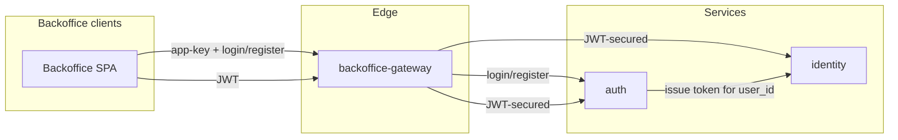

# Plan: Add backoffice-gateway, auth, auth briefs, and personas

Add the two new services (backoffice-gateway, auth) to the architecture docs, rename the existing auth brief to player-auth-baseline, add backoffice-auth-baseline, and nail down canonical persona/terminology with a glossary.

---

## Personas and terminology (canonical wording)

Use these terms consistently in all new and updated docs (backoffice-gateway, auth, identity, both briefs, and any future auth/backoffice docs).

| Concept | Term | Definition |
|--------|------|------------|
| Organization integrating with Proteon | **tenant** | The company or platform that has a tenancy on Proteon (e.g. game studio, white-label operator). Identified by `tenant_id`. Use "tenant" in technical and architecture docs. |
| End-users of the tenant's product | **players** | The userbase of a tenant: people who use the tenant's app (e.g. the customer platform). They authenticate as players; Identity holds player identities. |
| Anyone using the backoffice app | **backoffice user** | Umbrella term for both operator and tenant user. |
| Proteon's own staff using the backoffice | **operator** | Backoffice user who is Proteon staff. Uses the backoffice as a control plane (e.g. onboarding tenants, platform config). |
| Tenant's staff using the backoffice | **tenant user** | Backoffice user who is the tenant's employee. Uses the backoffice to manage their tenant (e.g. settings, analytics). |

**Glossary source of truth:** Add a single glossary (e.g. `docs/architecture/GLOSSARY.md` or a "Personas" subsection in `00_CONTEXT.md` or `product/PRODUCT_CONTEXT.md`) so there is one place to point to. New/updated docs reference this wording.

---

## Documents to add

| Document | Purpose |
|----------|--------|
| `docs/architecture/services/backoffice-gateway.md` | New service doc: edge service for backoffice traffic; app-key for auth routes (login/register), JWT for the rest; routes to auth and downstream backoffice APIs. Follow structure of `services/api-gateway.md` and `templates/SERVICE_TEMPLATE.md`. |
| `docs/architecture/services/auth.md` | New service doc: auth methods and flows for backoffice (credentials, registration, login; later OAuth/MFA); credential storage; exchange with Identity for token issuance. Identity holds user records only; link is `user_id`. Follow same template. |
| `docs/architecture/briefs/backoffice-auth-baseline.md` | New brief: baseline backoffice auth model — backoffice-gateway as single entry; login/register exposed on gateway, protected by app-key (not JWT); auth service owns credentials and flows, Identity issues JWTs; two backoffice user types (operators, tenant users). Baseline only. |
| `docs/architecture/GLOSSARY.md` (or Personas in `00_CONTEXT.md`) | Single source of truth for persona/terminology table above. |

---

## Documents to update

| Document | Change |
|----------|--------|
| `docs/architecture/briefs/auth-baseline.md` | **Rename** to `player-auth-baseline.md`. In the file: set title to "Player / Customer platform auth baseline"; add one short clarification that this brief describes auth for the customer platform (player-facing) and that backoffice auth is separate (`briefs/backoffice-auth-baseline.md`). Leave body otherwise as-is. |
| `docs/architecture/03_INDEX.md` | Service documents: add `services/backoffice-gateway.md`, `services/auth.md`. Architecture briefs: replace `briefs/auth-baseline.md` with `briefs/player-auth-baseline.md`, add `briefs/backoffice-auth-baseline.md`. Add GLOSSARY.md to index if created. |
| `docs/architecture/00_CONTEXT.md` | Section 8 (Service roles), Examples: add `backoffice-gateway` (edge), `auth` (domain). If glossary is a "Personas" subsection here instead of GLOSSARY.md, add the terminology table. |
| `docs/architecture/services/identity.md` | State that Identity holds user records (and token issuance) for all platform users — players and backoffice (operators, tenant users). Backoffice auth methods and credentials live in the auth service; link is `user_id`. Use canonical persona terms. |
| `docs/architecture/system/API_GATEWAY.md` | Add a short note: platform has two edge gateways — api-gateway (player-facing) and backoffice-gateway (backoffice); this doc describes the gateway role in general; backoffice-specific behaviour is in `services/backoffice-gateway.md`. |

---

## Documents left unchanged (for this pass)

- `system/SERVICE_TYPES.md` — No change unless backoffice-gateway is added to examples (optional).

---

## Flow (for the new brief)

---

## Summary

| Action | Documents |
|--------|-----------|
| **Add** | `services/backoffice-gateway.md`, `services/auth.md`, `briefs/backoffice-auth-baseline.md`, glossary (GLOSSARY.md or Personas in 00_CONTEXT) |
| **Rename** | `briefs/auth-baseline.md` → `briefs/player-auth-baseline.md` (plus title/clarification inside) |
| **Update** | `03_INDEX.md`, `00_CONTEXT.md`, `services/identity.md`, `system/API_GATEWAY.md` |

All new and updated text uses the canonical persona wording and stays at baseline level.
